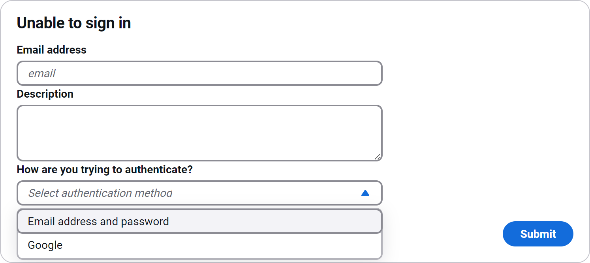
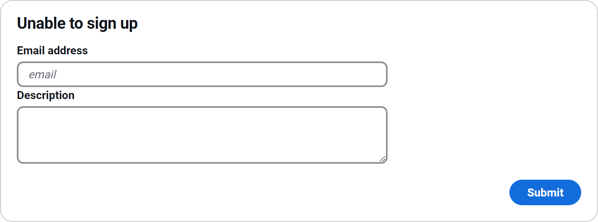
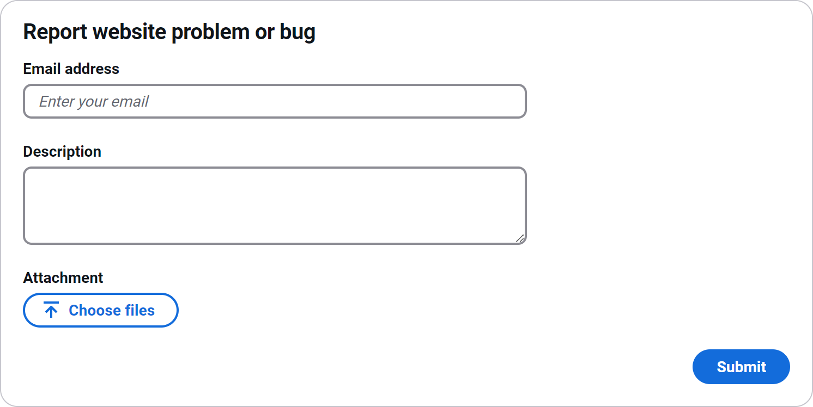
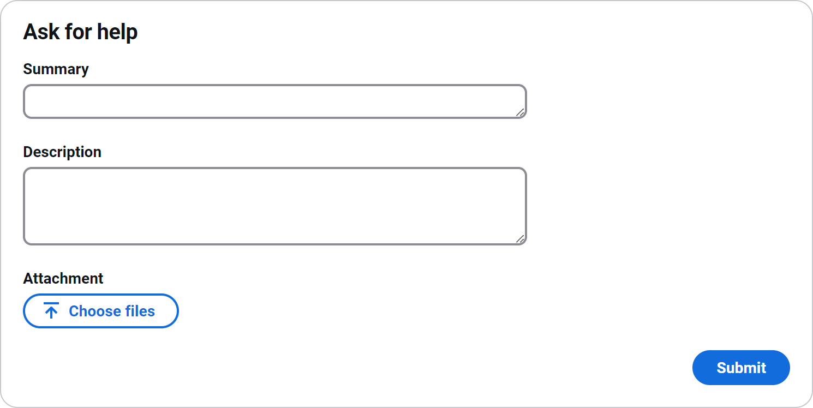

Asking for Help
===============

There are a few ways that you can ask for help and the most appropriate way will depend on why you want to create a support ticket.

It should be understood that the following section focuses on how you can ask for help with regards to the Solutions Hub itself. Solutions such as ONELab may have additional ways of asking for help and documentation for those solutions should be checked for that information.

Unable to sign in
-----------------

If you are unable to sign into the Solutions Hub with your username, please click on **Support** (on the top navigation bar) and then click on **Unable to sign in**:

It is important that you provide your correct email address when you fill in this form otherwise you will not receive any updates via email and it will not be possible to investigate the problem you are having.

Unable to sign up
-----------------

If you are unable to sign up - or create - an account for use with the Solutions Hub, please click on **Support** (on the top navigation bar) and then click on **Unable to sign up**:

It is important that you provide your correct email address when you fill in this form otherwise you will not receive any updates via email and it will not be possible to investigate the problem you are having.

General website problem or bug
------------------------------

If you are having a problem with the Solutions Hub that does not seem to be specific to a subscription's content or services, such as ONELab, please scroll to the bottom of the page and click on **Report website problem or bug**:

Please provide as much information as possible, including screenshots or other relevant attachments.

If you are accessing this form anonymously (i.e. not signed in), you will see a field to enter your email address. It is important that you provide your correct email address otherwise you will not receive any updates via email and it will not be possible to investigate the problem you are having.

General ask for help
--------------------

If you are signed in, the Support option will be a menu, of which the first option will be **Ask for help**. If you have a suggestion about the Solutions Hub, or you are having a problem that is **not** related to a subscription, you can choose this option to request help:

Please provide as much information as possible, including screenshots or other relevant attachments.
