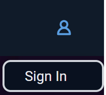
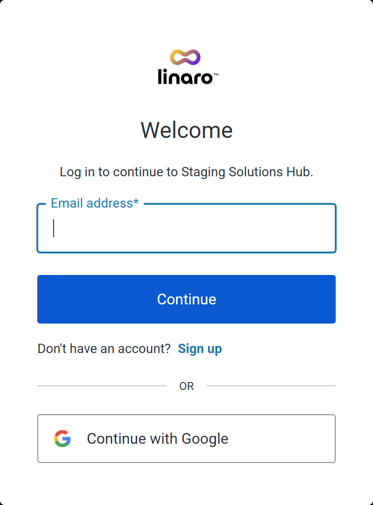
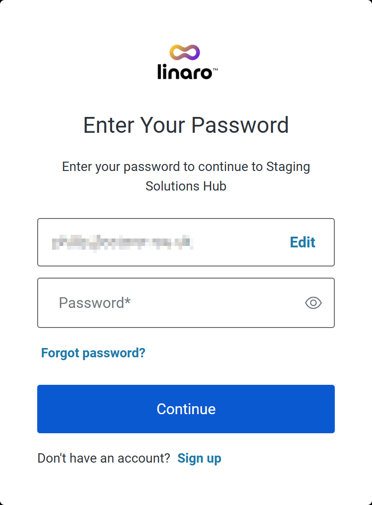
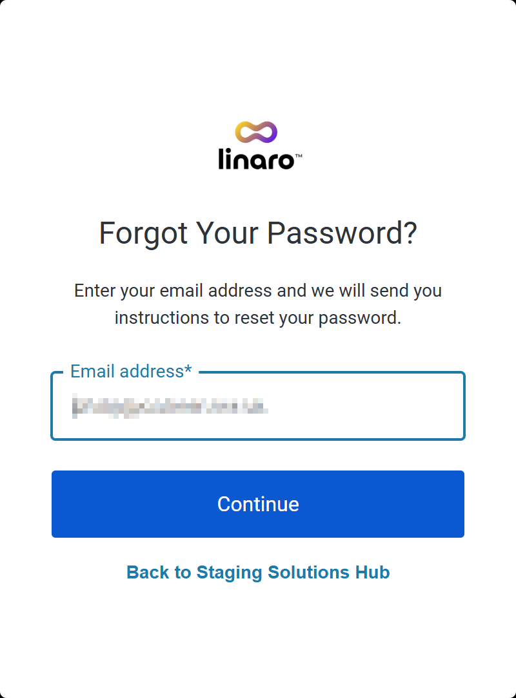

Signing In
----------

To sign in, click on the avatar icon in the top-right of the page and click on **Sign In**:

You will then go through the signing-in process, which can vary depending on whether or not you've used the Hub recently. Some of the following steps may not appear, or the screenshots may differ slightly.

At this screen, you have three choices:

1. If you already have a Solutions Hub account **or** if your organisation has an arrangement with Linaro to use their own authentication platform, enter your email address and click on **Continue**.

2. If you have a Google account, click on **Continue with Google** to authenticate with that account.

3. Otherwise, click on **Sign up** to create a new account.

If your organisation has an arrangement with Linaro, your browser will redirect to your company's authentication platform. Sign in there as usual. After that, you will be redirected back to the Solutions Hub.

If you already have a Solutions Hub account, you will be prompted to enter your password:

Enter your password and click on **Continue**. If your email address and password match the records, you will be taken back to the Solutions Hub.

If you have mistyped your email address or want to use a different email address, click on **Edit** to go back to the previous screen.

If you have forgotten your password, click on **Forgot password?**. You will be prompted to enter an email address:

Click on **Continue**.

.. note:: You will only receive an email if the email address provided matches an account on the system.

