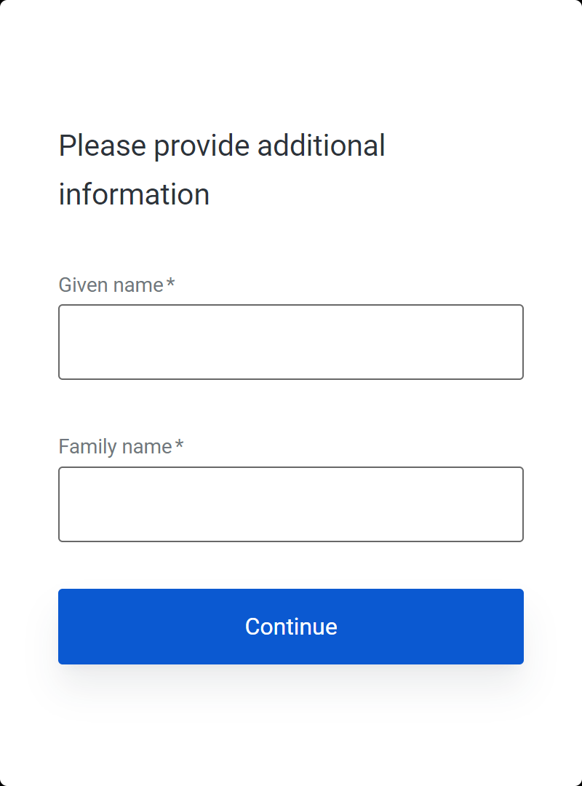
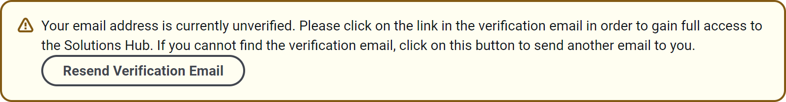
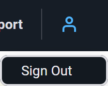

Sign Up For A New Account
-------------------------

After clicking on **Sign up**, the screen will change slightly but you still have three choices:

1. If you have a Google account, click on **Continue with Google** to authenticate with that account.

2. If you already have a Solutions Hub account **or** if your organisation has an arrangement with Linaro to use their own authentication platform, click on **Log in** to sign in with that account.

3. Otherwise, enter the email address you want to use with Linaro Solutions Hub and click on **Continue**. You will then be asked to enter a password of your own choice. Do so and click on **Continue**. You will then see a form asking for additional information:

.. note:: At this point, you should have received an email asking you to verify your email address. It is **strongly** recommended that you click on the verification link now, before you finish signing up for your Solutions Hub account.

If you have been following step #3 above, and you've filled in the additional information and clicked **Continue** without verifying your email address first, the web page will display a banner message like this:

If you are seeing this message, you need to follow these steps:

1. Find the verification email and click on the link. If you cannot find the email, click on the **Resend Verification Email** button and then follow these instructions.
2. Click on the avatar icon in the top-right of the page and then click on **Sign Out**.

3. Click on **Sign In / Sign Up** and, this time, go through the `Sign In process <signin>`_ since you have now created your account.
